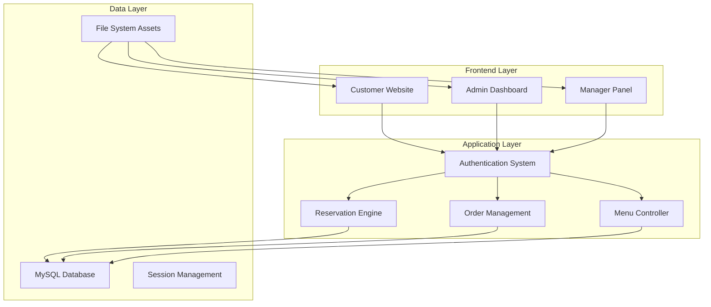

# 🍽️ Feliciano - Premium Restaurant Management System

<div align="center">

<h1 align="center">Feliciano Restaurant</h1>

**An elegant and comprehensive restaurant management solution featuring online reservations, menu discovery, and advanced order management.**

[](https://php.net)
[](https://mysql.com)
[](https://developer.mozilla.org/en-US/docs/Web/JavaScript)
[](https://getbootstrap.com)
[](LICENSE)

[🚀 Live Demo](#-live-demo) • [📖 Documentation](#-documentation) • [🛠️ Installation](#️-installation) • [🤝 Contributing](#-contributing)

</div>

---

## 📋 Table of Contents

- [🌟 Features](#-features)
- [🏗️ System Architecture](#️-system-architecture)
- [👥 User Roles](#-user-roles)
- [🛠️ Installation](#️-installation)
- [⚙️ Configuration](#️-configuration)
- [📁 Project Structure](#-project-structure)
- [🔐 Security Features](#-security-features)
- [📱 Mobile Responsiveness](#-mobile-responsiveness)
- [📊 Analytics & Reporting](#-analytics--reporting)
- [🗄️ Database Schema](#️-database-schema)
- [🎨 UI/UX Features](#-uiux-features)
- [🔧 Technical Stack](#-technical-stack)
- [🌟 Key Highlights](#-key-highlights)
- [📊 Project Statistics](#-project-statistics)
- [🛣️ Roadmap](#️-roadmap)
- [📞 Support & Contact](#-support--contact)
- [📄 License](#-license)
- [🙏 Acknowledgments](#-acknowledgments)

---

## 🌟 Features

### 🛒 **Customer Experience**
- **Premium Homepage**: Modern design with smooth parallax effects and hero sections.
- **Interactive Menu**: Explore categories (Breakfast, Platters, Meal Deals, Signature) with real-time filtering.
- **Smart Ordering**: Persistent cart with persistent state and beautiful order modals.
- **Table Reservation**: Easy-to-use booking system for dining in.
- **Customer Reviews**: 5-star rating system with real user feedback.
- **Responsive Gallery**: High-quality visual showcase of dishes and ambience.

### 🔧 **Admin & Management**
- **Comprehensive Dashboard**: Real-time overview of system stats and activities.
- **Menu Management**: Full CRUD operations for menu items, categories, and availability.
- **Reservation Oversight**: Manage, approve, or cancel customer bookings.
- **Order Processing**: Streamlined workflow for handling online and offline orders.
- **User Management**: Control user roles (Admin, Manager, Customer) and permissions.

---

## 🏗️ System Architecture



---

## 👥 User Roles

| Role | Access Level | Key Features |
|------|-------------|--------------|
| 🔧 **Administrator** | Full System Control | User management, menu oversight, reservation control, system settings |
| 👨‍💼 **Manager** | Operations Management | Order processing, reservation approval, menu updates, feedback review |
| 🛒 **Customer** | User Features | Browse menu, book tables, place orders, write reviews, manage profile |

---

## 🛠️ Installation

### Prerequisites

- **PHP 8.0+**
- **MySQL 8.0+**
- **Apache/Nginx**
- **Web Browser**

### Quick Start

1. **Clone the Repository**
   ```bash
   git clone https://github.com/your-username/feliciano-restaurant.git
   cd feliciano-restaurant
   ```

2. **Database Setup**
   ```sql
   CREATE DATABASE feliciano_db;
   USE feliciano_db;
   SOURCE database.sql;
   ```

3. **Configuration**
   Edit `config/database.php` with your credentials:
   ```php
   $host = "localhost";
   $user = "your_username";
   $pass = "your_password";
   $db   = "feliciano_db";
   ```

4. **Permissions**
   Ensure `assets/images/` is writable by the web server.

---

## 📁 Project Structure

```
Feliciano Restaurant/
├── 🎨 assets/                # Static assets (CSS, JS, Images)
├── ⚙️ config/                # System configuration
│   └── database.php          # Database connection
├── 🔐 auth/                  # Authentication modules
│   ├── login.php             # Secure login
│   └── register.php          # User registration
├── 🔧 admin/                 # Administrator backend
│   ├── dashboard.php         # Analytics overview
│   └── manage-menu.php       # Product control
├── 👨‍💼 manager/               # Management interface
├── 📁 pages/                 # Frontend views
│   ├── menu.php              # Digital menu
│   └── reservation.php       # Booking system
├── 📁 includes/              # Reusable components
├── 📄 index.php              # Application entry point
└── 🗄️ database.sql            # Database schema
```

---

## 🔐 Security Features

### 🛡️ **Data Protection**
- **SQL Injection Prevention**: Using prepared statements for all database interactions.
- **XSS Protection**: Input sanitization and output encoding for user reviews and profile data.
- **Session Management**: Secure session handling with proper expiration and role validation.

### 🔒 **Access Control**
- **Role-Based Access (RBAC)**: Strict permission checks for Admin, Manager, and Customer roles.
- **Secure Authentication**: Hashed password storage and secure login mechanisms.

---

## 📱 Mobile Responsiveness

### 📐 **Responsive Design**
- **Mobile-First Approach**: Optimized for 📱 mobile, 💻 tablet, and 🖥️ desktop.
- **Bootstrap 5.3 Framework**: Utilizing a modern grid system and components.
- **Touch-Friendly UI**: Large interactive elements for easier mobile navigation.

---

## 📊 Analytics & Reporting

### 📈 **Management Insights**
- **Order Statistics**: Track daily sales and popular items.
- **Reservation Trends**: Monitor peak hours and table usage.
- **User Activity**: Overview of customer registrations and interactions.

---

## 🗄️ Database Schema

The system uses a robust relational database structure to manage restaurant operations. Below are the core tables:

| Table Name | Description |
|------------|-------------|
| `users` | Core user accounts with role-based access (Admin, Manager, Customer, Staff). |
| `customers` | Detailed customer profiles, linked to users, with order history analytics. |
| `roles` | Defines system access levels and permissions. |
| `menu_items` | Catalog of food items, including prices, categories, and availability status. |
| `orders` | Records for both online and offline orders, tracking status and totals. |
| `order_items` | Granular data for each item within an order, including quantities and prices. |
| `reservations` | Table booking records with guest counts, dates, and special occasions. |
| `tables` | Physical restaurant table management (capacity, location, and real-time status). |
| `reviews` | Customer feedback and 5-star rating system management. |
| `restaurant_settings` | Global configuration for contact info, opening hours, and system behavior. |
| `admin_notifications` | Real-time system alerts for staff regarding new orders or reservations. |
| `user_sessions` | Secure session tracking for authenticated users. |

---

## 🎨 UI/UX Features

- **Gold & Charcoal Theme**: A premium color palette for a luxury feel.
- **Glassmorphism**: Subtle blur effects on modals and overlays.
- **Hover Animations**: Interactive elements that respond to user movement.
- **Mobile First**: Fully responsive design optimized for all screen sizes.
- **SweetAlert2**: Beautiful, non-intrusive notification system.

---

## 🔧 Technical Stack

- **Frontend**: HTML5, CSS3, JavaScript (ES6+), Bootstrap 5.3, JQuery
- **Backend**: PHP (Core)
- **Database**: MySQL
- **Tooling**: Font Awesome, Google Fonts, SweetAlert2

---

## 🌟 Key Highlights

- **Premium Design**: Modern and elegant interface for high-end restaurants.
- **Interactive Experience**: Smooth transitions and real-time updates.
- **Comprehensive Solution**: Handles both dining-in and online orders seamlessly.
- **Advanced Admin Panel**: Powerful tools for restaurant management.

---

## 📊 Project Statistics

```
📊 Project Metrics:
├── 📁 Total Files: 50+
├── 💻 Lines of Code: 10,000+
├── 🗄️ Database Tables: 10+
├── 👥 User Roles: 3
└── 🎨 UI Components: 100+
```

---

## 🛣️ Roadmap

- [ ] **Online Payments**: Integration with SSLCommerz/bKash.
- [ ] **Email Automation**: Booking and order confirmations.
- [ ] **Rider Tracking**: Real-time delivery updates.
- [ ] **AI Recommendations**: Personalized menu suggestions.
- [ ] **Table QR Codes**: Direct ordering from the table.

---

## 📞 Support & Contact

### 🆘 **Getting Help**
- **📧 Email Support**: support@feliciano.com
- **💬 Technical Support**: help.feliciano.com

### 🌐 **Community**
- **📘 Facebook**: [Feliciano Community](https://facebook.com/feliciano)
- **🐦 Twitter**: [@FelicianoRest](https://twitter.com/feliciano)

---

## 📄 License

This project is licensed under the **MIT License** - see the `LICENSE` file for details.

```
MIT License

Copyright (c) 2026 Feliciano Restaurant Development Team

Permission is hereby granted, free of charge, to any person obtaining a copy
of this software and associated documentation files (the "Software"), to deal
in the Software without restriction, including without limitation the rights
to use, copy, modify, merge, publish, distribute, sublicense, and/or sell
copies of the Software, and to permit persons to whom the Software is
furnished to do so, subject to the following conditions:

The above copyright notice and this permission notice shall be included in all
copies or substantial portions of the Software.
```

---

## 🙏 Acknowledgments

### 👨‍💻 **Development Team**
- **Lead Developer**: [Your Name]
- **Documentation**: [Your Name]

### 🎨 **Inspiration**
- **Patoare**: UI/UX and documentation structure inspiration.
- **Material Design**: For clean and professional design principles.

---

<div align="center">

**Made with ❤️ for the Culinary Industry**

[⬆️ Back to Top](#-feliciano---premium-restaurant-management-system)

</div>
