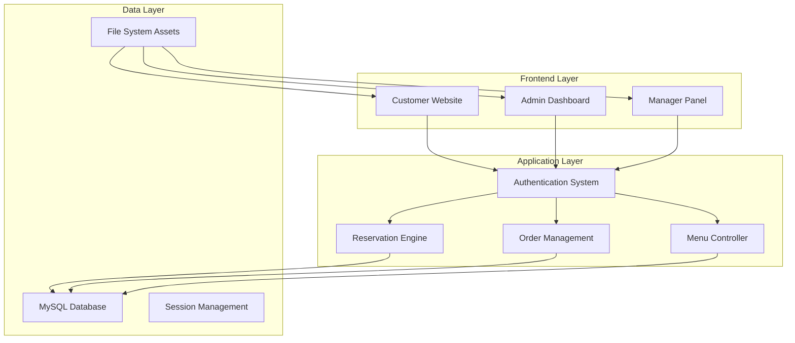

# 🍽️ Feliciano - Premium Restaurant Management System

<div align="center">

<h1 align="center">Feliciano Restaurant</h1>

**An elegant and comprehensive restaurant management solution featuring online reservations, menu discovery, and advanced order management.**

[](https://php.net)
[](https://mysql.com)
[](https://developer.mozilla.org/en-US/docs/Web/JavaScript)
[](https://getbootstrap.com)
[](LICENSE)

[🚀 Live Demo](#-live-demo) • [📖 Documentation](#-documentation) • [🛠️ Installation](#️-installation) • [🤝 Contributing](#-contributing)

</div>

---

## 📋 Table of Contents

- [🌟 Features](#-features)
- [🏗️ System Architecture](#️-system-architecture)
- [👥 User Roles](#-user-roles)
- [🛠️ Installation](#️-installation)
- [⚙️ Configuration](#️-configuration)
- [📁 Project Structure](#-project-structure)
- [🗄️ Database Schema](#️-database-schema)
- [🎨 UI/UX Features](#-uiux-features)
- [🔧 Technical Stack](#-technical-stack)
- [🛣️ Roadmap](#️-roadmap)
- [📄 License](#-license)

---

## 🌟 Features

### 🛒 **Customer Experience**
- **Premium Homepage**: Modern design with smooth parallax effects and hero sections.
- **Interactive Menu**: Explore categories (Breakfast, Platters, Meal Deals, Signature) with real-time filtering.
- **Smart Ordering**: Persistent cart with persistent state and beautiful order modals.
- **Table Reservation**: Easy-to-use booking system for dining in.
- **Customer Reviews**: 5-star rating system with real user feedback.
- **Responsive Gallery**: High-quality visual showcase of dishes and ambience.

### 🔧 **Admin & Management**
- **Comprehensive Dashboard**: Real-time overview of system stats and activities.
- **Menu Management**: Full CRUD operations for menu items, categories, and availability.
- **Reservation Oversight**: Manage, approve, or cancel customer bookings.
- **Order Processing**: Streamlined workflow for handling online and offline orders.
- **User Management**: Control user roles (Admin, Manager, Customer) and permissions.

---

## 🏗️ System Architecture



---

## 👥 User Roles

| Role | Access Level | Key Features |
|------|-------------|--------------|
| 🔧 **Administrator** | Full System Control | User management, menu oversight, reservation control, system settings |
| 👨‍💼 **Manager** | Operations Management | Order processing, reservation approval, menu updates, feedback review |
| 🛒 **Customer** | User Features | Browse menu, book tables, place orders, write reviews, manage profile |

---

## 🛠️ Installation

### Prerequisites

- **PHP 8.0+**
- **MySQL 8.0+**
- **Apache/Nginx**
- **Web Browser**

### Quick Start

1. **Clone the Repository**
   ```bash
   git clone https://github.com/your-username/feliciano-restaurant.git
   cd feliciano-restaurant
   ```

2. **Database Setup**
   ```sql
   CREATE DATABASE feliciano_db;
   USE feliciano_db;
   SOURCE database.sql;
   ```

3. **Configuration**
   Edit `config/database.php` with your credentials:
   ```php
   $host = "localhost";
   $user = "your_username";
   $pass = "your_password";
   $db   = "feliciano_db";
   ```

4. **Permissions**
   Ensure `assets/images/` is writable by the web server.

---

## 📁 Project Structure

```
Feliciano Restaurant/
├── 🎨 assets/                # Static assets (CSS, JS, Images)
│   ├── css/                  # Modern stylesheets
│   ├── js/                   # Interactive scripts
│   └── images/               # Dish and UI images
├── ⚙️ config/                # System configuration
│   └── database.php          # Database connection
├── 🔐 auth/                  # Authentication modules
│   ├── login.php             # Secure login
│   └── register.php          # User registration
├── 🔧 admin/                 # Administrator backend
│   ├── dashboard.php         # Analytics overview
│   └── manage-menu.php       # Product control
├── 👨‍💼 manager/               # Management interface
├── 📁 pages/                 # Frontend views
│   ├── menu.php              # Digital menu
│   └── reservation.php       # Booking system
├── 📁 includes/              # Reusable components
├── 📄 index.php              # Application entry point
└── 🗄️ database.sql            # Database schema
```

---

## 🗄️ Database Schema

The core system relies on several key tables:
- `users`: Account management and roles.
- `menu_items`: Product catalog and categories.
- `orders` & `order_items`: Sales and transaction tracking.
- `reservations`: Dining-in booking data.
- `reviews`: Customer feedback and ratings.

---

## 🎨 UI/UX Features

- **Gold & Charcoal Theme**: A premium color palette for a luxury feel.
- **Glassmorphism**: Subtle blur effects on modals and overlays.
- **Hover Animations**: Interactive elements that respond to user movement.
- **Mobile First**: Fully responsive design optimized for all screen sizes.
- **SweetAlert2**: Beautiful, non-intrusive notification system.

---

## 🔧 Technical Stack

- **Frontend**: HTML5, CSS3, JavaScript (ES6+), Bootstrap 5.3, JQuery
- **Backend**: PHP (Core)
- **Database**: MySQL
- **Tooling**: Font Awesome, Google Fonts, SweetAlert2

---

## 🛣️ Roadmap

- [ ] **Online Payments**: Integration with SSLCommerz/bKash.
- [ ] **Email Automation**: Booking and order confirmations.
- [ ] **Rider Tracking**: Real-time delivery updates.
- [ ] **AI Recommendations**: Personalized menu suggestions.
- [ ] **Table QR Codes**: Direct ordering from the table.

---

## 📄 License

This project is licensed for **educational and portfolio purposes**. See the project files for more details.

---

<div align="center">

**Made with ❤️ for the Culinary Industry**

[⬆️ Back to Top](#-feliciano---premium-restaurant-management-system)

</div>
